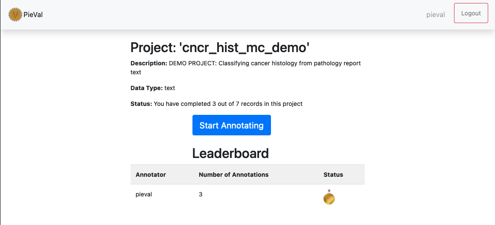

# How to use PieVal

This page will walk you through the mechanics of using pieval

### Splash Screen

Immediately after login, you will be presented with a landing page that includes a list of all the projects you have access to:

### Select a project

Click the blue project name which is also a link to the project and it will land you in the home page for that project.  Here you will see the leaderboard and some stats about how many examples you have already annotated as well as how many you have left to annotate.

### Annotation Worfklow

Next, click the big button that says "Start Annotating" which will launch the annotation workflow. In this workflow, you will be presented with data requiring annotation that you have not already completed.  You can quit at anytime and all your progress will be saved.

Here is the crux of PieVal and time to think about it as an assertion tester.  You are presented with a prompmt (aka the assertion), some data, and 4 possible response buttons.  Your task is to choose the response that best reflects the prompt's relationship to the data being presented.

1. Agree - You agree that the prompt is supported by the data
1. Review - You disagree that the prompt is supported by the data and you have knowledge indicating that this data is a special case that needs review
1. Pass - You don't have the knowledge to make an assessment in this case
1. Disagree - You know that the prompt is NOT supported by the data

The response to choosing Disagree will vary based on whether or not the project is Binary or Multiclass.  If Binary, your response will simply be recorded.  By disagreeing that the prompt is supported by the data, you are declaring that the inverse of the prompt is supported by the data.  Binary indicates only two options.

If Multiclass, a disambiguation workflow will be presented.  In this case we cannot assume the inverse of the prompt is correct since you have previously declared a fixed set of possible classes that must describe the data.  In these cases you are asked to select the most appropriate alternative class in a follow up screen, seen here:

>NOTE: Take special note of the 'Doh!' button in the top navbar.  This allows you to move back ONE example and change your response.

